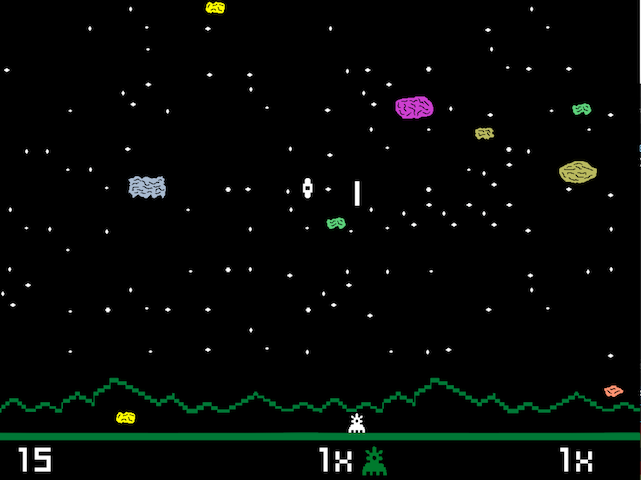
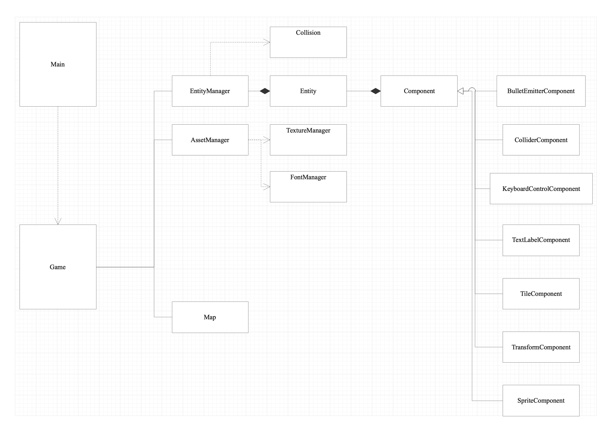

# CPPND: Capstone project

## MeteorCanon Game

## Overview
This is a repo for the Capstone project in the [Udacity C++ Nanodegree Program](https://www.udacity.com/course/c-plus-plus-nanodegree--nd213). The code for this repo was inspired by [this](https://courses.pikuma.com/courses/2dgameengine) SDL course and [that](http://perso.b2b2c.ca/~sarrazip/dev/cosmosmash.html) game.

For this project, I have decided to do a partial clone of my first game played on my first console (Mattel Intellivision).  This game was Astromash.

The game was built and tested on Mac OSX and Linux platform.

# File Structure

This repository contains :
- `doc`: Documentation generated by Doxygen.
- `assets/`: Contains the assets for the game.
- `src/`: Source.  Contains the .cpp and .h files.
- `src/component` : Source.  Contains the different components source files (.h and .cpp).
- `lib/glm`: Contains the glm math library.
- `CMakeLists.txt`: cmake configuration file.
- `README.md`: This file
- `LICENSE` : License file (GNU General Public License)

# Class Structure

## Dependencies for Running Locally
* cmake >= 3.7
  * All OSes: [click here for installation instructions](https://cmake.org/install/)
* make >= 4.1 (Linux, Mac), 3.81 (Windows)
  * Linux: make is installed by default on most Linux distros
  * Mac: [install Xcode command line tools to get make](https://developer.apple.com/xcode/features/)
* SDL2 >= 2.0, SDL2 Image and SDL2 TTF
  * All installation instructions can be found [here](https://wiki.libsdl.org/Installation)
  * Note that for Linux, an `apt` or `apt-get` installation is preferred to building from source :
    - sudo apt-get install libsdl2-dev
    - sudo apt-get install libsdl2-image-dev
    - sudo apt-get install libsdl2-ttf-dev
  * Note that for Mac OSX, an `brew`installation is preferred to building from source :
    - brew install sdl2
    - brew install sdl2_image
    - brew install sdl2-ttf
* gcc/g++ >= 5.4
  * Linux: gcc / g++ is installed by default on most Linux distros
  * Mac: same deal as make - [install Xcode command line tools](https://developer.apple.com/xcode/features/)

## Basic Build Instructions

1. Clone this repo.
2. Make a build directory in the top level directory: `mkdir build && cd build`
3. Compile: `cmake .. && make`
4. Run it: `./MeteorCanon`.

## Playing instructions
Objective of the Game
To hit as many meteors and bombs without being hit yourself.  As your score grows higher, the game speeds up
and give you more challenge.

1. Use the left and right keys for moving your Canon.
2. Use Space key for shooting the meteors and spinners.

## Scoring Formula
Scores Up
- Big Rock Hit = 10
- Small Rock Hit = 20
- Big Spinner Hit = 40
- Small Spinner Hit = 80

Scores Down
- Big Rock Lands = -5
- Small Rock Lands = -10
- Canin is Hit or a Spinner Land = -100

Points values are multiplied by the level number.

## Levels Changes
- 1x Level : Score up to 999
- 2x Level : Score 1,000 - 4,9999
- 3x Level : Score 5,000 - 19,999
- 4x Level : Score 20,000 - 49,999
- 5x Level : Score 50,000 - 99,999
- 6x Level : Score 100,000 and over

## Rubric

__README (All Rubric Points REQUIRED)__

|DONE | CRITERIA | MEETS SPECIFICATIONS| WHERE |
|-- | -- | --| -- |
| :heavy_check_mark: | A README with instructions is included with the project |The README is included with the project and has instructions for building/running the project. If any additional libraries are needed to run the project, these are indicated with cross-platform installation instructions. You can submit your writeup as markdown or pdf.| |
| :heavy_check_mark: | The README indicates which project is chosen. | The README describes the project you have built. The README also indicates the file and class structure, along with the expected behavior or output of the program. | |
| :heavy_check_mark: | The README includes information about each rubric point addressed. | The README indicates which rubric points are addressed. The README also indicates where in the code (i.e. files and line numbers) that the rubric points are addressed. | |

__Compiling and Testing (All Rubric Points REQUIRED)__

|DONE | CRITERIA | MEETS SPECIFICATIONS| WHERE |
|-- | -- | --| -- |
| :heavy_check_mark: | The submission must compile and run. | The project code must compile and run without errors. We strongly recommend using cmake and make, as provided in the starter repos. If you choose another build system, the code must compile on any reviewer platform. |

__Loops, Functions, I/O__

|DONE | CRITERIA | MEETS SPECIFICATIONS| WHERE |
|-- | -- | --| -- |
| :heavy_check_mark: | The project demonstrates an understanding of C++ functions and control structures.| A variety of control structures are used in the project. The project code is clearly organized into functions.| See Entity::Update function (line 15 in entity.cpp), see EntityManager::checkCollisions() (line 68) in entitymanager.cpp, see Game::processInput() (line 168) in game.cpp  and in all *.cpp file |
| :heavy_check_mark: | The project reads data from a file and process the data, or the program writes data to a file. | The project reads data from an external file or writes data to a file as part of the necessary operation of the program.| See Map::LoadMap(...) (line 18) in map.cpp  |
| :heavy_check_mark: | The project accepts user input and processes the input.|The project accepts input from a user as part of the necessary operation of the program.|  game.cpp Game::processInput() member function |

__Object Oriented Programming__

|DONE | CRITERIA | MEETS SPECIFICATIONS| WHERE |
|-- | -- | --| -- |
| :heavy_check_mark: | The project uses Object Oriented Programming techniques. | The project code is organized into classes with class attributes to hold the data, and class methods to perform tasks. | See SpriteComponent class in spritecomponent.h, see EntityManager class in entitymanager.h, see AssetManager class in assetmanager.h, and it's the case for all the classes defined in the project |
| :heavy_check_mark: | Classes use appropriate access specifiers for class members. | All class data members are explicitly specified as public, protected, or private.| See Game class in game.h, see Component class in component.h, all the classes defined in the project respect this criteria |
| :heavy_check_mark: | Class constructors utilize member initialization lists. | All class members that are set to argument values are initialized through member initialization lists.| See Map:Map(...) constructor (line 10) in map.cpp, see Entity::Entity(...) constructor (line 8) in entity.cpp |
| :heavy_check_mark: | Classes abstract implementation details from their interfaces. | All class member functions document their effects, either through function names, comments, or formal documentation. Member functions do not change program state in undocumented ways.| See SpriteComponent class in spritecomponent.h and spritecomponent.cpp, see EntityManager class in entitymanager.h and entitymanager.cpp, all the classes defined in the project respect this criteria |
| :heavy_check_mark: | Classes encapsulate behavior. | Appropriate data and functions are grouped into classes. Member data that is subject to an invariant is hidden from the user. State is accessed via member functions.| See Game class in game.h and game.cpp, EntityManager Class in entitymanager.h and entitymanager.cpp, all the classes defined in the project respect this criteria |
| :heavy_check_mark: | Classes follow an appropriate inheritance hierarchy. | Inheritance hierarchies are logical. Composition is used instead of inheritance when appropriate. Abstract classes are composed of pure virtual functions. Override functions are specified.| See Component Class in component.h and all components classes derived from it (SpriteComponent, BulletEmitterComponent, ColliderComponent, KeyboardControlComponent, etc...) |
| :heavy_check_mark: | Overloaded functions allow the same function to operate on different parameters. | One function is overloaded with different signatures for the same function name. | See EntityManager::GetLock(...) function with two behavior with two signatures see line 35 and 36 in entitymanager.h |
| :heavy_check_mark: | Derived class functions override virtual base class functions. |One member function in an inherited class overrides a virtual base class member function.| See TransFormComponent::Update(...) class (line 16) in transformcomponent.h |
| :heavy_check_mark: | Templates generalize functions in the project. | One function is declared with a template that allows it to accept a generic parameter.| See Entity::AddComponent(...) (line 33) in entity.h and Entity::GetComponent() (line 49) in entity.h |

__Memory Management__

|DONE | CRITERIA | MEETS SPECIFICATIONS| WHERE |
|-- | -- | --| -- |
| :heavy_check_mark: | The project makes use of references in function declarations. | At least two variables are defined as references, or two functions use pass-by-reference in the project code.| See EntityManager::AddEntity function (line 30) entitymanager.h, see TextLabelComponent::SetLabelText(...) (line 19) in textlabelcomponent.h, see FontManager::LoadFont(...) (line 12) in fontmanager.h |
| :heavy_check_mark: | The project uses destructors appropriately. | At least one class that uses unmanaged dynamically allocated memory, along with any class that otherwise needs to modify state upon the termination of an object, uses a destructor. | See Game::~Game() destructor (line 23) in game.cpp, see EntityManager::~EntityManager() destructor (line 12) in entitymanager.cpp |
| :heavy_check_mark: | The project uses scope / Resource Acquisition Is Initialization (RAII) where appropriate. | The project follows the Resource Acquisition Is Initialization pattern where appropriate, by allocating objects at compile-time, initializing objects when they are declared, and utilizing scope to ensure their automatic destruction.| See EntityManager::Render() (line 38) in entitymanager.cpp |
| | The project follows the Rule of 5. | For all classes, if any one of the copy constructor, copy assignment operator, move constructor, move assignment operator, and destructor are defined, then all of these functions are defined.| |
| | The project uses move semantics to move data, instead of copying it, where possible. | For classes with move constructors, the project returns objects of that class by value, and relies on the move constructor, instead of copying the object. | |
| :heavy_check_mark: | The project uses smart pointers instead of raw pointers. | The project uses at least one smart pointer: unique_ptr, shared_ptr, or weak_ptr. The project does not use raw pointers.| See EntityManager Class using shared_ptr for the entities vector (line 45) in entitymanager.h, See Game Class useing unique_ptr for SDL ressources (renderer and window) (line 45 and line 47) in game.h, no raw pointers are use and were mostly replace by smart pointers including SDL ressources pointers. |

__Concurrency__

|DONE | CRITERIA | MEETS SPECIFICATIONS| WHERE |
|-- | -- | --| -- |
| :heavy_check_mark: | The project uses multithreading. | The project uses multiple threads in the execution.| See EntityManager::SimulateCollisions() (line 50) in entitymanager.cpp (thread is used for collisions detection) |
|  | A promise and future is used in the project. | A promise and future is used to pass data from a worker thread to a parent thread in the project code.| |
| :heavy_check_mark: | A mutex or lock is used in the project. | A mutex or lock (e.g. std::lock_guard or `std::unique_lock) is used to protect data that is shared across multiple threads in the project code.| Used in EntityManager Class (line 29, 41, 61 and 77) in entitymanager.cpp, see Entity Class (line 35) in entity.h |
|  | A condition variable is used in the project. | A std::condition_variable is used in the project code to synchronize thread execution.| |
